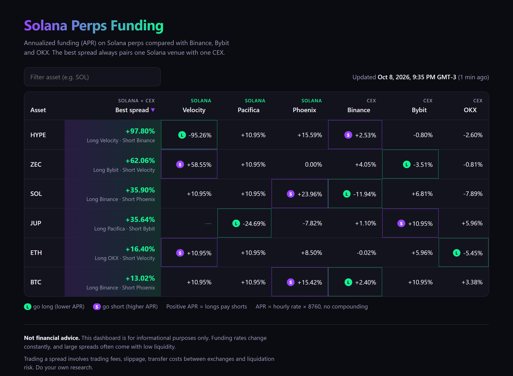

# Solana Perps Funding Dashboard

Compares perpetual funding rates on Solana DEXs with Binance, Bybit and OKX, and highlights the widest Solana-vs-CEX spread for each asset.

**Live site:** https://littguto.github.io/solana-perps-funding-dashboard/



## What it does

- Pulls the latest settled funding rate for every perp market on three Solana venues and three CEXs.
- Normalizes everything to an **hourly rate** and a simple **APR** (`hourly × 8760`, no compounding), so 1h, 4h and 8h funding intervals are comparable.
- For each asset listed on both sides, finds the largest APR spread between one Solana venue and one CEX: **long where APR is lower, short where it is higher**.
- Publishes a static dashboard with sortable columns, an asset filter, the last-update time and a warning when an exchange failed to respond.

Positive APR means longs pay shorts.

### How it works

```
GitHub Actions (every 30 min)
  └─ scripts/build_data.py ── sources/solana.py ─┐
                           └─ sources/cex.py ────┴─▶ public/data.json ─▶ public/index.html (GitHub Pages)
```

- Each exchange is fetched in isolation. A failure is logged in `failed_exchanges` and the others carry on.
- If every exchange on one side fails, the script exits with code 1 and keeps the previous `data.json`.
- The workflow commits `data.json` only when the data actually changed (ignoring `updated_at`), then deploys `public/` to Pages.

## Run locally

Requires Python 3.10+.

```bash
python -m venv .venv
```

```bash
.venv\Scripts\activate
```

(On macOS/Linux: `source .venv/bin/activate`.)

```bash
pip install -r requirements.txt
```

```bash
python scripts/build_data.py
```

```bash
python -m http.server 8000 --directory public
```

Then open http://localhost:8000. The page must be served over HTTP, because `fetch('data.json')` does not work from `file://`.

You can also run a single source on its own, from inside `scripts/`:

```bash
python -m sources.solana
```

```bash
python -m sources.cex
```

## Data sources

| Venue | Type | Endpoint | Funding interval |
|---|---|---|---|
| [Velocity](https://docs.velocity.exchange/developers/data-api) (formerly Drift) | Solana | `GET https://data.velocity.exchange/external/coingecko/contracts`, field `funding_rate` (percent per hour) | 1h |
| [Pacifica](https://docs.pacifica.fi/api-documentation/api/rest-api/markets/get-prices.md) | Solana | `GET https://api.pacifica.fi/api/v1/info/prices`, field `funding` (fraction per hour) | 1h |
| [Phoenix](https://docs.phoenix.trade/api/exchange/get-funding-overview.md) | Solana | `GET https://perp-api.phoenix.trade/v1/funding/overview`, computed as `fundingAmountPerUnit / markPrice` | Accrues hourly, settles every 24h |
| Binance, Bybit, OKX | CEX | [ccxt](https://github.com/ccxt/ccxt) `fetch_funding_rates`, USDT-margined linear perps | Per contract (1h / 4h / 8h), read from the API |

CEX assets are SOL, BTC, ETH and JUP, plus any market currently listed on Velocity.

Notes on units:

- **Velocity:** the docs do not state the unit of `funding_rate`. I checked it against `/market/{symbol}/fundingRates` (`fundingRate / oraclePriceTwap`) and it is a percentage.
- **Phoenix:** `fundingRate` is described as a decimal but is actually a percentage, so the rate is computed from the raw amounts instead.

Not included:

- **Jupiter Perps** charges an hourly borrow fee to both sides instead of funding. It is only readable on-chain.
- **Adrena** lost its operator in August 2026.
- **Zeta** ceased operations in May 2025.

## Next steps

- [ ] **Binance/Bybit geo-blocking.** Both exchanges block US IPs, which is where GitHub-hosted runners live. Options: a self-hosted runner outside the US, or a proxy.
- [ ] **Liquidity context.** Add open interest and 24h volume per market. Velocity is in private beta with very thin books, so its spreads look large but are not tradable at size.
- [ ] **History.** Keep a rolling time series and show how each spread evolved, instead of only the latest snapshot.
- [ ] **More venues.** Add Bulk once a public API is documented. Consider showing Jupiter's borrow fee in a separate column.
- [ ] **Costs.** Estimate the net spread after trading fees on both legs.
- [ ] **Tests.** Add unit tests for the normalization and spread logic, using recorded API responses.
- [ ] **Alerts.** Notify (Telegram/Discord) when a spread crosses a threshold.

## Disclaimer

This project is for informational purposes only and is **not financial advice**. Funding rates change constantly. Trading a spread involves fees, slippage, transfer costs between exchanges and liquidation risk.

## License

TBD.
